# Association 

Application to show many-to-many relationship principle and rspec test suite.

There is User and Group objects that will bee used. One user can be part of many groups and one group can have many members.

Start page will show you a list of all groups and their members.

Instructions for how to create a User & Groups and how to make associations further down.

### System

- OS Fedora 39
    - KDE Plasma 5.27.10
    - Kernel 6.6.9
- Ruby 3.2.2
- Rails 7.0.8
- RSpec 3.12
    - rspec-core 3.12.2
    - rspec-expectations 3.12.3
    - rspec-mocks 3.12.6
    - rspec-rails 6.1.0
    - rspec-support 3.12.1
- IDE VS Code

### Database initialization

To populate with dummy data, from root directory, run:
```bash
rails db:seed
```

### How to Create group

From the navbar click "Create group".
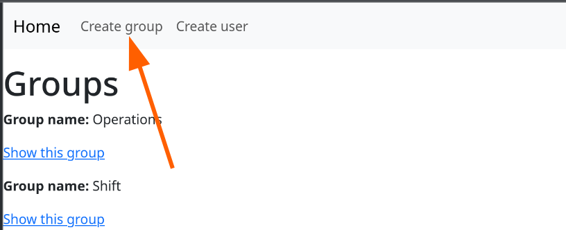

Chose a group name that must be unique.
Chose which users you want to add to group, can also be empty

Click "Create Group" button under the form.

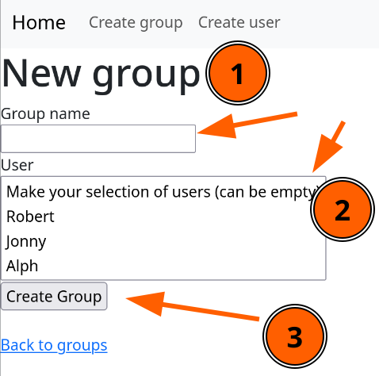

### How to add and remove user from group

From home page click "Show this group" for desired group (from here you can also delete group).

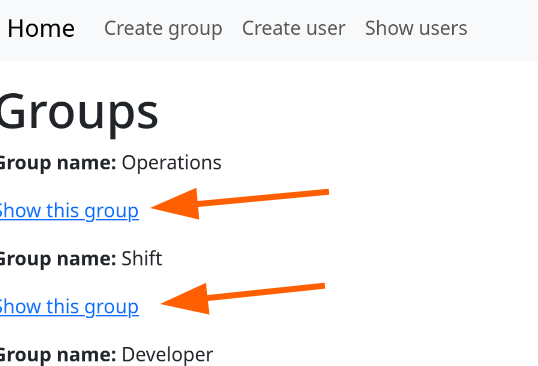

Click "Edit this group"

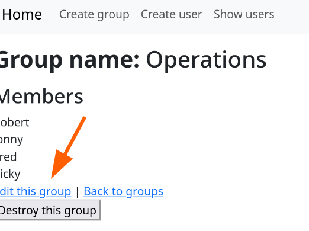

From here all current users will be marked and you can mark/unmark users you to add/remove.
Click "Update Group" for changes to take effect.

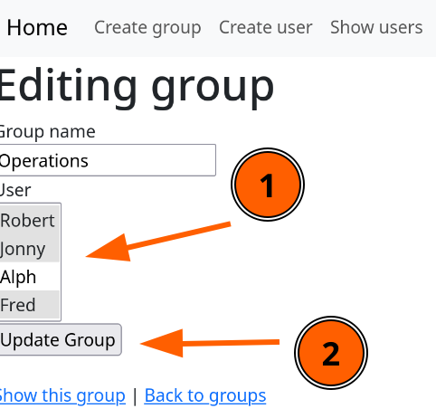

### How to Create user

From the navbar click "Create user"

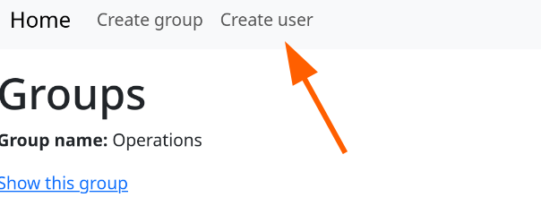

Fill in the form fields.
Chose which groups user should be a part of, can also be empty.

Click "Creat User" button under the form.

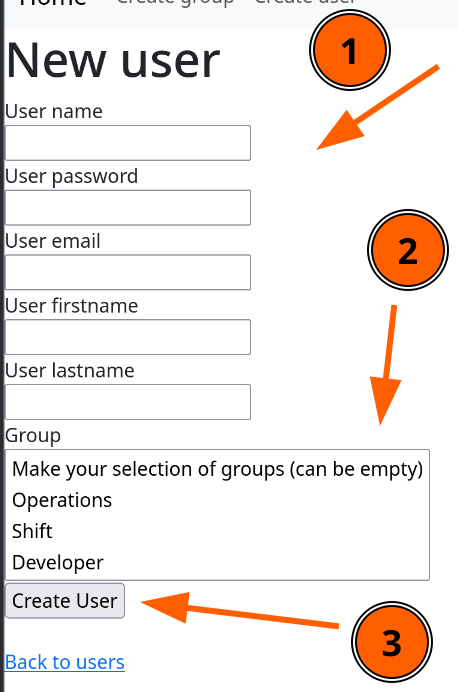

### How to add and remove group from user

From navbar click "Show users"

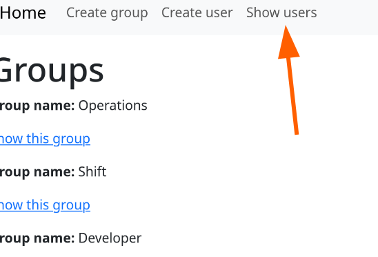

Click "Show this user" for desired user (from here you can also delete user)

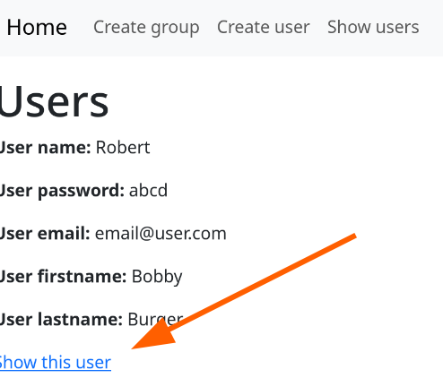

Click "Edit this user"

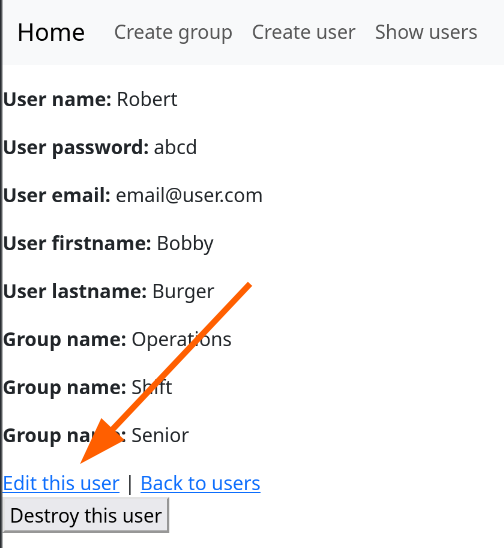

From here all current groups will be marked and you can mark/unmark the groups you want to add/remove.
Then click "Update User" under the form


### How to run the test suite

From the root directory run:
```bash
rspec spes
```
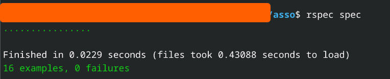